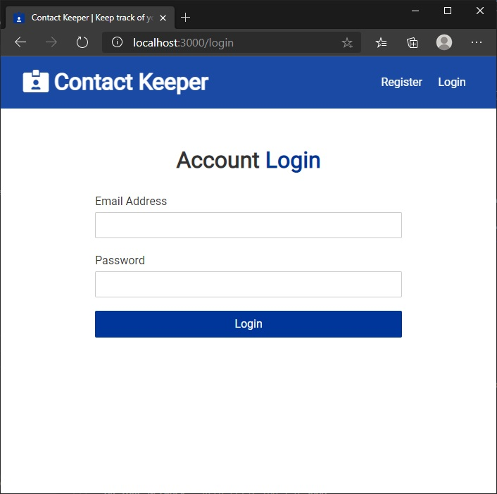
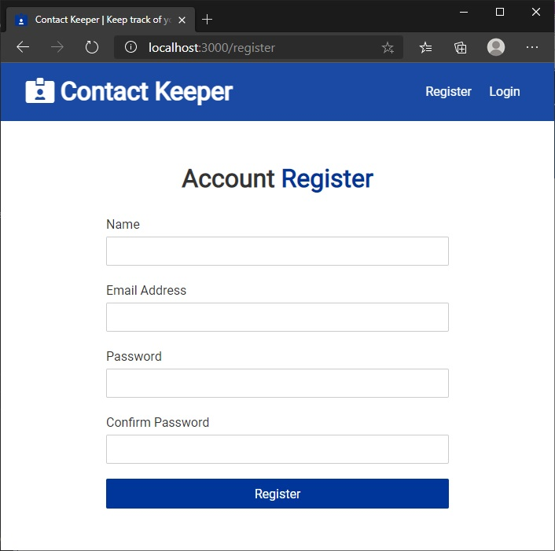
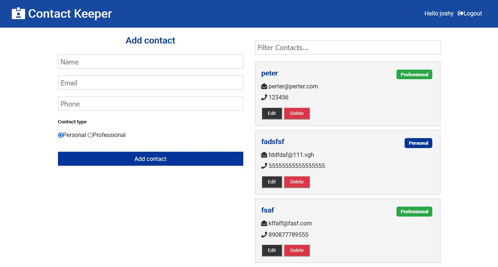
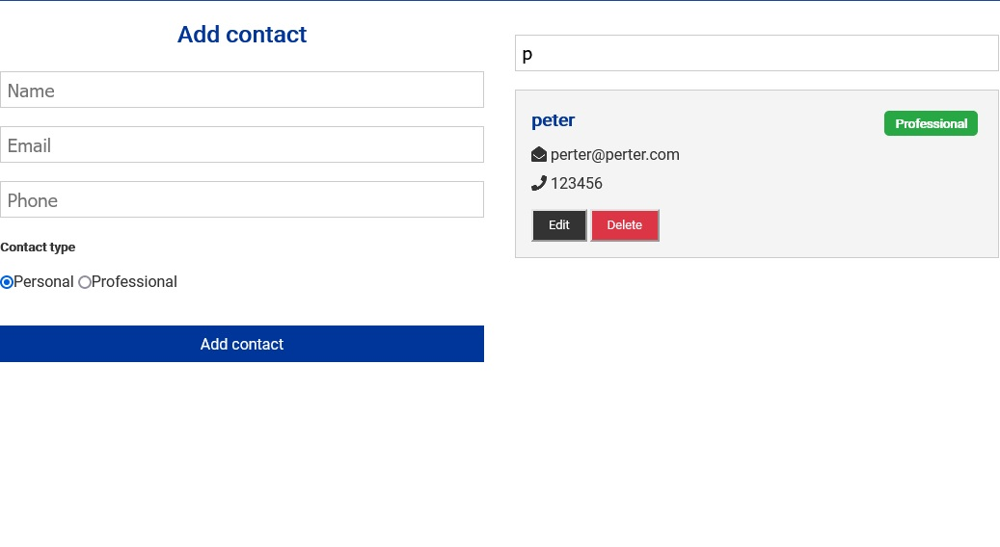

<p align="center">
  <a href="http://xander-contact-keeper.herokuapp.com/" target="blank"></a>
</p>

# Description

Full stack MERN contact manager with React hooks, context & JWT authentication Application allows user to create basic contact book containing contact name, email address, phone number. A contact can be added, edited and deleted. Search among contacts is also possible. To create a contact book, user needs to register and log in.

<p align="center">
  
   
  
  

</p>

## Live demo

Live demo of the app is hosted on Heroku.  
Visit [http://xander-contact-keeper.herokuapp.com/](http://xander-contact-keeper.herokuapp.com/)

Test user credentials:

> login - _test@mail.com_  
> password - _123456_

_Due to demo reasons and heroku free terms, if an app receives no web traffic in a 30-minute period, it will sleep. Therefore, during the first launch, the application may take longer to load than usual, approximately 15 - 20 seconds. So please be patient and wait for the app to launch. Subsequent launches will be relatively fast._

## Technology stack

> ### FrontEnd
>
> - React
> - React Hooks
> - React Context API
> - React router
>
> ### BackEnd
>
> - Node
> - Express
> - JWT
> - MongoDB
> - Heroku hosting
>   <br>

# Usage

Clone this repository to desired location

```Shell
git clone https://github.com/XanderUZZZER/contact-keeper.git
```

<br>

Open cloned project in your editor and install server and client dependencies:

```Shell
npm i
npm client-install
```

<br>

### Mongo connection setup

Edit your /config/default.json file to include the correct MongoDB URI
<br>
<br>

### Run Server

```bash
npm run dev     # Express & React :3000 & :5000
npm run server  # Express API Only :5000
npm run client  # React Client Only :3000
```
